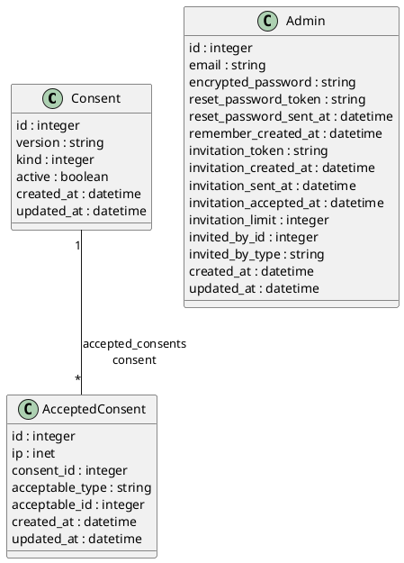

# ER Diagram
You need to have PlantUML to see this diagram

```plantuml
@startuml
allowmixing
class Consent  {
    id : integer
    version : string
    kind : integer
    active : boolean
    created_at : datetime
    updated_at : datetime
}

class AcceptedConsent  {
    id : integer
    ip : inet
    consent_id : integer
    acceptable_type : string
    acceptable_id : integer
    created_at : datetime
    updated_at : datetime
}

class Admin  {
    id : integer
    email : string
    encrypted_password : string
    reset_password_token : string
    reset_password_sent_at : datetime
    remember_created_at : datetime
    invitation_token : string
    invitation_created_at : datetime
    invitation_sent_at : datetime
    invitation_accepted_at : datetime
    invitation_limit : integer
    invited_by_id : integer
    invited_by_type : string
    created_at : datetime
    updated_at : datetime
}

Consent "1" -- "*" AcceptedConsent : "accepted_consents\nconsent"

@enduml

```